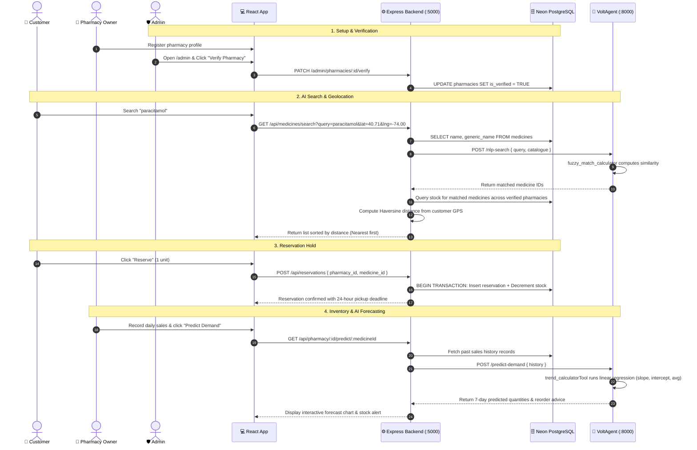

# 📄 Comprehensive Project Guide & Architectural Explanation
# AI-Powered Smart Pharmacy Availability Checker

---

## 1. Executive Summary & Problem Statement

### 🛑 The Real-World Problem
Finding essential medications during medical emergencies or chronic illness treatments is often frustrating and time-consuming:
1. **Inefficient Store Hopping**: Patients physically visit multiple pharmacies only to find that their required drug is out of stock.
2. **Medical Terminology & Misspelling**: Generic drug names (*e.g., Acetaminophen, Azithromycin*) and brand variations (*e.g., Crocin, Calpol*) lead to frequent search misses and confusion.
3. **Reactive Inventory Management**: Pharmacies lack predictive analytics, causing stockouts during high-demand periods or dead stock accumulation for slow-moving medicines.

### 💡 The Solution
**AI-Powered Smart Pharmacy** is an end-to-end intelligent platform with real-time GPS distance calculation, multi-agent AI search & demand forecasting, and a 3-role ecosystem: **Customer (User)**, **Pharmacy Owner**, and **System Administrator**.

---

## 2. Detailed Role-by-Role Breakdown

```
                  ┌─────────────────────────────────────────┐
                  │       SMART PHARMACY PLATFORM           │
                  └───────┬─────────────┬─────────────┬─────┘
                          │             │             │
        ┌─────────────────┴─┐   ┌───────┴──────────┐  └───────────────────┐
        ▼                   ▼   ▼                  ▼                      ▼
┌───────────────┐   ┌────────────────────────┐   ┌───────────────────────────┐
│ 👤 Customer   │   │ 🏥 Pharmacy Owner      │   │ 🛡️ System Administrator   │
├───────────────┤   ├────────────────────────┤   ├───────────────────────────┤
│ • AI Search   │   │ • Inventory & Pricing  │   │ • Verify Pharmacies       │
│ • Distance Sort│  │ • AI 7-Day Forecasting │   │ • Monitor Low-Stock Alerts│
│ • 1-Click Hold│   │ • Low Stock Alerts     │   │ • User Management         │
│ • Pickup Track│   │ • Sales Recording      │   │ • System KPI Analytics    │
└───────────────┘   └────────────────────────┘   └───────────────────────────┘
```

---

### 👤 1. Customer (End-User)

The Customer module focuses on solving the medicine discovery and reservation challenge with zero friction.

#### Key Capabilities & Features:
1. **Natural Language & Typo-Tolerant AI Search**:
   - Customers can enter misspelled medicine names (*e.g., "paracetmol"*, *"azithro"*) or colloquial commercial brand names (*e.g., "crocin"*).
   - The query is processed by the AI `MedicineSearchAgent`, which matches the intent to the official catalogue.
2. **GPS Distance & Real-Time Availability Ranking**:
   - The app uses browser Geolocation (`navigator.geolocation`) and computes exact driving/travel distances using the **Haversine formula**.
   - Search results are sorted from closest to farthest, displaying pharmacy name, address, price, and current in-stock quantity.
3. **1-Click Medicine Reservation**:
   - Customers can reserve their required medication directly from the search results.
   - When reserved, a 24-hour collection window is generated (`pickup_by`), and stock is held exclusively for that customer.
4. **Active Reservations Dashboard** (`/reservations`):
   - Displays real-time status: `pending` $\rightarrow$ `confirmed` $\rightarrow$ `ready` $\rightarrow$ `completed`.
   - Allows instant reservation cancellation with automatic inventory restoration if the customer changes their mind.

---

### 🏥 2. Pharmacy Owner

The Pharmacy Owner portal is designed for pharmacists and inventory managers to optimize stock, fulfill customer orders, and prevent stockouts.

#### Key Capabilities & Features:
1. **Multi-Tab Management Portal** (`/pharmacy`):
   - **Inventory**: Add, update stock quantities, set unit prices, and define custom low-stock thresholds for each medicine in their store.
   - **Low Stock Alerts**: Instant alert panel highlighting medicines that have fallen below the configured safe quantity threshold.
   - **Demand Prediction**: AI-powered 7-day sales forecasting engine.
   - **Reservations**: Live feed of customer reservations where pharmacists can confirm orders and mark items ready for customer pickup.
2. **AI-Powered 7-Day Demand Forecasting**:
   - Pharmacists log daily sales records (`recordSale`).
   - The `DemandPredictionAgent` runs statistical Ordinary Least Squares (OLS) linear regression and moving average analysis on the store's sales history.
   - The agent outputs predicted daily demand quantities, classifies the trend (`increasing`, `stable`, `decreasing`), and computes recommended reorder thresholds and safety stock levels.
3. **Pharmacy Profile Setup**:
   - Set up store address, city, phone number, and precise GPS coordinates (`latitude`, `longitude`) so nearby customers can locate the shop.

---

### 🛡️ 3. System Administrator

The Administrator portal oversees system integrity, compliance, and platform-wide healthcare metrics.

#### Key Capabilities & Features:
1. **Administrative Overview & Metrics** (`/admin`):
   - Live KPI dashboard displaying:
     - **Total Users** registered across all roles.
     - **Total Pharmacies** registered in the network.
     - **Total Medicines** in the global master catalogue.
     - **Active Reservations** processed across the system.
     - **System-Wide Low Stock Alerts** across all participating pharmacies.
2. **Pharmacy Verification & Quality Control**:
   - When a new pharmacy registers, its status is initially `Pending Verification` (`is_verified = FALSE`).
   - Administrators review the pharmacy details (address, license, contact) and click **"Verify"** to activate the store so its inventory appears to public customers.
3. **User & Account Management**:
   - Search, inspect, and remove unauthorized accounts or inactive pharmacy stores to maintain database health.

---

## 3. Technology Stack & Framework Explanation

| Layer | Framework / Library | Architectural Role & Justification |
| :--- | :--- | :--- |
| **Frontend UI** | **React.js 18** | High-performance Virtual DOM, single-page navigation via React Router 6, and reactive state management. |
| **Styling & FX** | **Custom CSS Design Tokens (`theme.css`)** | Clinical dark-teal color tokens, `@keyframes spin` animated spinners, responsive card layouts with zero bulky external CSS frameworks. |
| **Backend** | **Node.js & Express.js** | Non-blocking event-driven runtime ideal for handling REST API traffic, DB transactions, and AI service orchestration. |
| **Authentication** | **JWT (jsonwebtoken) + bcryptjs** | Stateless JSON Web Token authentication (7-day validity) and salted 10-round password hashing. |
| **Database** | **PostgreSQL (Neon Serverless)** | Relational ACID-compliant cloud database with foreign key constraints, connection pooling (`pg`), and auto-scaling. |
| **AI Framework** | **VoltAgent (`@voltagent/core`)** | Multi-Agent AI system providing autonomous agents (`MedicineSearchAgent`, `DemandPredictionAgent`, `PharmacyConsultantAgent`) with tool execution. |
| **LLM Provider** | **OpenRouter API** | OpenRouter provides high-availability access to top models (*GPT-4o-mini, Llama 3.3 70B, Gemini 2.0 Flash, Nemotron*) with deterministic mathematical fallbacks. |

---

## 4. End-to-End Workflow Diagram



---

## 5. Mathematical Algorithms Used

### A. Haversine Distance Formula (GPS Sorting)
Calculates great-circle distance between user coordinates $(\text{lat}_1, \text{lon}_1)$ and pharmacy coordinates $(\text{lat}_2, \text{lon}_2)$ on Earth (radius $R \approx 6371\text{ km}$):

$$\Delta\text{lat} = \text{lat}_2 - \text{lat}_1, \quad \Delta\text{lon} = \text{lon}_2 - \text{lon}_1$$

$$a = \sin^2\left(\frac{\Delta\text{lat}}{2}\right) + \cos(\text{lat}_1)\cos(\text{lat}_2)\sin^2\left(\frac{\Delta\text{lon}}{2}\right)$$

$$d = 2R \cdot \text{atan2}\left(\sqrt{a}, \sqrt{1 - a}\right)$$

---

### B. Ordinary Least Squares (OLS) Linear Trend Forecasting
Predicts future daily sales $y$ for day $x$ by determining trend slope $m$ and baseline intercept $c$:

$$\text{Slope } (m) = \frac{n \sum (xy) - \sum x \sum y}{n \sum (x^2) - (\sum x)^2}$$

$$\text{Intercept } (c) = \frac{\sum y - m \sum x}{n}$$

$$\hat{y}_{\text{day } k} = \max(1, \text{round}(m \cdot k + c))$$

---

## 6. Pre-Seeded Demo Accounts (1-Click Ready)

| Role | Email | Password | Pre-configured Data |
| :--- | :--- | :--- | :--- |
| 👤 **Customer** | `customer@pharmacy.com` | `password123` | Search medicines, live reservations, distance sorting |
| 🏥 **Pharmacy Owner** | `pharmacy@pharmacy.com` | `password123` | Linked to *CarePlus Central Pharmacy* with live stock & sales data |
| 🛡️ **System Admin** | `admin@pharmacy.com` | `password123` | Full dashboard stats, pharmacy verification controls |

---

## 7. VoltAgent Agent API Endpoints Reference

The AI Microservice (running on **`http://localhost:8000`**) exposes both **VoltAgent Standard Agent Endpoints** and **Compatibility Endpoints**.

### 🌟 Swagger Interactive Documentation
- **URL**: [http://localhost:8000/ui](http://localhost:8000/ui)
- View schemas, test live agent calls, and inspect parameter specifications interactively.

---

### 📡 Standard Agent Endpoints (`/agents/*`)

#### 1. List All Registered Agents
- **Endpoint**: `GET /agents`
- **Description**: Returns all active agents, model details, registered tools, and memory status.
- **cURL**:
  ```bash
  curl http://localhost:8000/agents
  ```
- **Response**:
  ```json
  {
    "success": true,
    "data": [
      {
        "id": "MedicineSearchAgent",
        "name": "MedicineSearchAgent",
        "status": "idle",
        "model": "nvidia/nemotron-3-super-120b-a12b:free",
        "tools": [{ "id": "fuzzy_match_calculator", "name": "fuzzy_match_calculator" }]
      },
      {
        "id": "DemandPredictionAgent",
        "name": "DemandPredictionAgent",
        "status": "idle",
        "model": "nvidia/nemotron-3-super-120b-a12b:free",
        "tools": [{ "id": "trend_calculator", "name": "trend_calculator" }]
      },
      {
        "id": "PharmacyConsultantAgent",
        "name": "PharmacyConsultantAgent",
        "status": "idle",
        "model": "nvidia/nemotron-3-super-120b-a12b:free",
        "tools": []
      }
    ]
  }
  ```

---

#### 2. Synchronous Agent Execution (`POST /agents/:id/text`)
- **Endpoint**: `POST /agents/:id/text`
- **Description**: Synchronously sends prompts or conversation history to an agent and receives the result.
- **cURL**:
  ```bash
  curl -X POST http://localhost:8000/agents/PharmacyConsultantAgent/text \
    -H "Content-Type: application/json" \
    -d '{
      "input": "What are common OTC alternatives for mild headache?",
      "options": {
        "temperature": 0.7,
        "maxOutputTokens": 300
      }
    }'
  ```

---

#### 3. Real-Time Streaming (`POST /agents/:id/stream` or `POST /agents/:id/chat`)
- **Endpoint**: `POST /agents/:id/stream` (Raw SSE events) or `POST /agents/:id/chat` (Vercel AI SDK `useChat` compatible)
- **Description**: Streams text generation and tool call execution events real-time via Server-Sent Events (SSE).
- **cURL**:
  ```bash
  curl -N -X POST http://localhost:8000/agents/PharmacyConsultantAgent/chat \
    -H "Content-Type: application/json" \
    -d '{
      "input": "Can I take Ibuprofen with Paracetamol?",
      "options": { "temperature": 0.7 }
    }'
  ```

---

#### 4. Structured JSON Output with Tool Execution (`output` option)
- **Endpoint**: `POST /agents/:id/text` with structured JSON schema.
- **cURL**:
  ```bash
  curl -X POST http://localhost:8000/agents/MedicineSearchAgent/text \
    -H "Content-Type: application/json" \
    -d '{
      "input": "Query: paracitamol. Catalogue: [{\"id\":1,\"name\":\"Paracetamol 500mg\"}]",
      "options": {
        "output": {
          "type": "object",
          "schema": {
            "type": "object",
            "properties": {
              "matches": {
                "type": "array",
                "items": {
                  "type": "object",
                  "properties": {
                    "id": { "type": "number" },
                    "name": { "type": "string" },
                    "score": { "type": "number" }
                  },
                  "required": ["id", "name", "score"]
                }
              }
            },
            "required": ["matches"]
          }
        }
      }
    }'
  ```

